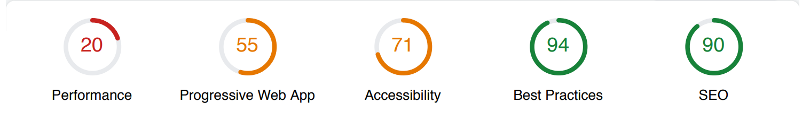
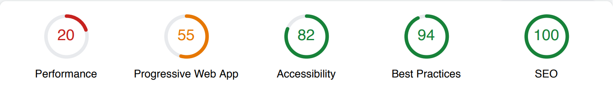

A walk through the real effort to transition an enterprise level Ember application to a progressive web application.

Part three: Bundle web fonts and preload
<!--more-->

## Ugh, web fonts
Our design team was using [TypeKit](https://typekit.com/). This tool let's designers include a package of fonts and then developers can just deploy a script on their site, which fetches those fonts at run time.

This is great, unless you care about performance. Up until this point, our brand fonts haven't changed in several years. After much negotation with the design team, I was able to kill off TypeKit from our application.

## Why TypeKit is a bad actor
Lighthouse was dinging our performance score for several reasons specifically because of TypeKit:

- It took around 400ms to fetch the TypeKit script
- There are multiple round-trip requests to TypeKit (for analytics I guess?)

We also were getting dinged for non-legible text on page load, because we had to wait for TypeKit to download fonts. This took 150ms for each font. In our case this was 4 requests, for two fonts (normal weight and bold weight).

## Step one - bundle fonts
This is really straight forward. If you're not using web fonts and assuming you own your font, just add it to your application and reference it from your style sheet.

```css
@font-face {
    font-family: Helvetica;
    src:
        url("/path/to/your/font.woff2") format('woff2'),
        url("/path/to/your/font.woff") format('woff'),
        url("/path/to/your/font.otf") format("opentype");
    }
```

If you're using an addon to share code across Ember applications, you could bundle fonts in the addon, in your `index.js` file:

```javascript
treeForPublic: function () {
    const fontsDirectory = new Funnel(join(this.root, 'vendor/fonts'), {
        destDir: '/path/to/your/fonts/in/the/addon'
    });

    return mergeTrees([fontsDirectory]);
}
```

And then your CSS becomes:

```css
@font-face {
    font-family: Helvetica;
    src:
        url("/vendor/fonts/font.woff2") format('woff2'),
        url("/vendor/fonts/font.woff") format('woff'),
        url("/vendor/fonts/font.otf") format("opentype");
    }
```

## Step two - swap
For our progressive web application, we want content to be visible as soon as possible. Even with our fonts included in the build, there's a bit of lag time until they're requested and content is rendered. We can use [font-display](https://developer.mozilla.org/en-US/docs/Web/CSS/@font-face/font-display) to fix this.

```css
@font-face {
    font-family: Helvetica;
    font-display: swap;
    src:
        url("/vendor/fonts/font.woff2") format('woff2'),
        url("/vendor/fonts/font.woff") format('woff'),
        url("/vendor/fonts/font.otf") format("opentype");
    }
```

I went with `swap`, so that our fonts will block for a very small amount of time but can be swapped out over an infinite time frame. What this means in practice is that given the font-family:

```css
font-family: Helvetica, "Helvetica Neue", Arial, sans-serif;
```

The browser will try and render content with fonts in this order. Because we use `font-display: swap`, the initial paint to the user might appear in `Arial` and as soon as `Helvetica` is available, we'll swap it out for that font. Yes, this does mean users could see a blip in how text is rendered on load.

## Preload
`swap` was ok, but we can use [preload](https://developer.mozilla.org/en-US/docs/Web/HTML/Preloading_content) to inform the browser that these resources will be needed right away. I can move my fonts in the the `<head>` as:


<link rel="preload" href="{{rootURL}path/to/my/font.woff2" as="font" type="font/woff2" crossorigin>


Not all of my supported browsers actual [support preload](https://caniuse.com/#search=preload). 95% of my users have a supported browser, so the 5% that don't will at least see the font `swap`.

## Results
Before:


After:


We got a little better on accessibility and maxed out our SEO score, but our performance score didn't go anywhere. However we did lose the TypeKit network request and the multiple network round-trips to TypeKit. Also our time to first paint and first meaningful interactive got around .5 seconds faster. I'll take it.

_note: The SEO score going up was not a result of web fonts. At the time we were not serving a robots.txt file correctly._

Moving on, why the hell is there **65 kB** of `lodash` in my vendor build?

## Keep reading
- [Baseline]() 
- [Add web manifest]() 
- [Remove liquid fire]() 
- [Bundle web fonts]() _(you are here)_
- [Random Lodash]()
- [Moment Timezones]()
- [Remove Showdown]()
- [Lazy Locales]()
- [Service Worker]()